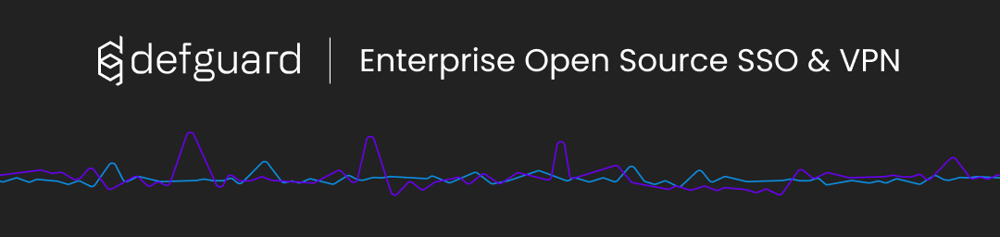

 <p align="center">
    
 </p>

**defguard gateway** is a client service for [defguard](https://github.com/DefGuard/defguard) which can be used to create your own [WireGuard:tm:](https://www.wireguard.com/) VPN servers for secure and private networking.

To learn more about the system see our [documentation](https://defguard.gitbook.io).

## Quick start

If you already have your defguard instance running you can set up a gateway by following our [deployment guide](https://defguard.gitbook.io/defguard/features/setting-up-your-instance/gateway).

## Documentation

See the [documentation](https://docs.defguard.net) for more information.

## Community and Support

Find us on Matrix: [#defguard:teonite.com](https://matrix.to/#/#defguard:teonite.com)

## Contribution

Please review the [Contributing guide](https://defguard.gitbook.io/defguard/for-developers/contributing) for information on how to get started contributing to the project. You might also find our [environment setup guide](https://defguard.gitbook.io/defguard/for-developers/dev-env-setup) handy.

## Verifiability of releases

We provide following ways to verify the authenticity and integrity of official releases:

### Docker Image Verification with Cosign

All official Docker images are signed using [Cosign](https://docs.sigstore.dev/cosign/overview/). To verify a Docker image:

1. [Install](https://github.com/sigstore/cosign?tab=readme-ov-file#installation) cosign CLI

2. Verify the image signature (replace <IMAGE_TAG> with the tag you want to verify):
   ```bash
   cosign verify --certificate-identity-regexp="https://github.com/DefGuard/gateway" \
     --certificate-oidc-issuer="https://token.actions.githubusercontent.com" \
     ghcr.io/defguard/defguard:<IMAGE_TAG>
   ```

### Release Asset Verification

All release assets (binaries, packages, etc.) include SHA256 checksums that are automatically generated and published with each GitHub release:

1. Download the release asset and copy its corresponding checksum from the [releases page](https://github.com/DefGuard/gateway/releases)

2. Verify the checksum:
   ```bash
   # Linux/macOS
   echo known_sha256_checksum_of_the_file path/to/file | sha256sum --check
   ```

# Legal
WireGuard is [registered trademarks](https://www.wireguard.com/trademark-policy/) of Jason A. Donenfeld.
